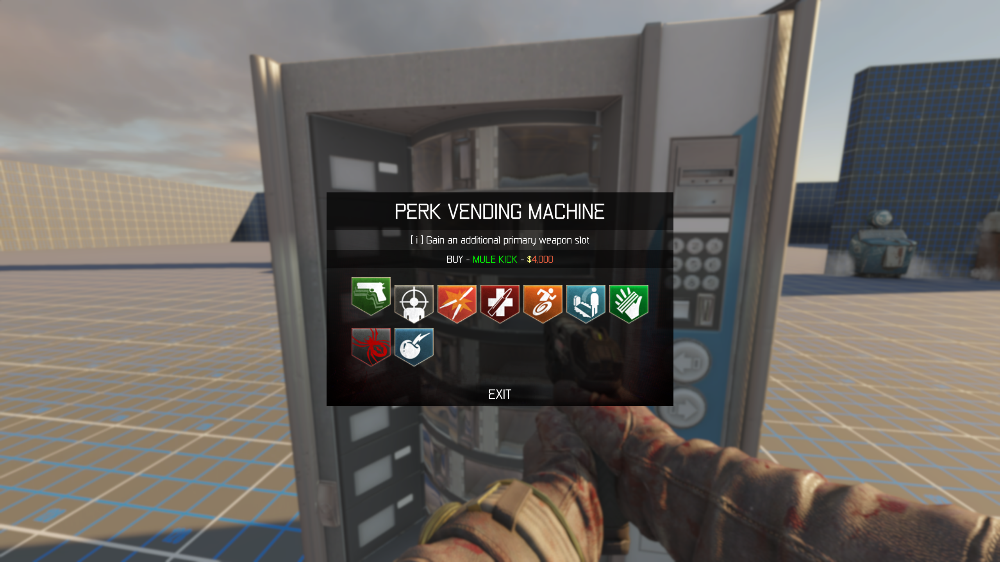

# Buyable Perk Machine
- Allows you to add a Buyable Perk Machine to your zombies map

## Screenshot

## Notes - Read (Important)
- Before you start, make sure both Electric Cherry and Widow's Wine are
turned on in your map. To do this, add these two lines to your map's
GSC and CSC files:

`#using scripts\zm\_zm_perk_electric_cherry;`\
`#using scripts\zm\_zm_perk_widows_wine;`

- These perks are set to show up in the menu by default. If a perk is in
the menu but not in your map, you'll get an error. If you don't want
to use one or both of these perks, remove them from the list. Check the
"Adding Perks to the Menu" section below for how to edit this list, and
take out perks you don’t want rather than adding new ones.

- You don't need to modify the menu to accommodate more perks; it
automatically scales in size based on the number of perks you add.
As Todd Howard famously said in 2015, "It just works."

- This menu does require some modifications to the perk widget. I've
updated all my previously released custom HUDs to be compatible with
this menu. If you're using the latest version of any of my HUDs,
there's no need to make any Lua changes—just follow the instructions
below to add perks to the menu.

- If you’d like to update an older version of my HUD currently in your map
to ensure compatibility, simply re-download it.

- Then, you have two options: either place the contents of the
`your_maps_folder` into your map's folder and confirm replacement of
all files (faster method), OR just replace the PerksContainer Lua file.
Do this if you have made any modifications to the HUD that you'd like to keep
This is located in `your_maps_folder/ui/uieditor/widgets/HUD`

- For those using their own custom HUD or the stock BO3 HUD:
I’ve included a perk widget with only the necessary modifications to
work with this menu. You'll just need to implement it.

- Lastly, if you'd prefer not to manually clip the machines, you can
create a collision map for the model you're using.

- Now you're ready to start with the instructions below.

## Instructions
1) Drop `map_source` into bo3 root

2) Place the contents of `your_maps_folder` into your map's folder

3) In GSC & CSC:
`#using scripts\zm\_zm_buyable_perk_machine;`

4) In your zone file:
`include,zm_buyable_perk_machine`

## Radiant Setup
1) In radiant, open the prefab browser and find `zm_buyable_perk_machine`, place one or more of these in your map.

2) Select the prefab and open it

3) Select the struct and open the `Entity Info` tab

4) Change the `model` KVP to the name of the model you would like to use for your machine.

5) Add this model to your zone file `xmodel,my_model_name` (If you keep my example model, you'll still need to add it to your zone)

## Adding perks to the menu
1) Open the perks container lua file, to find this go to: `your_maps_folder/ui/uieditor/widgets/HUD`

2) Find the `CoD.ZMPerks` table at the top of the file

3) Find the comments I have left, add any extra perks as needed

## Credits
Kingslayer Kyle\
Scobalula\
JariK\
Ronan