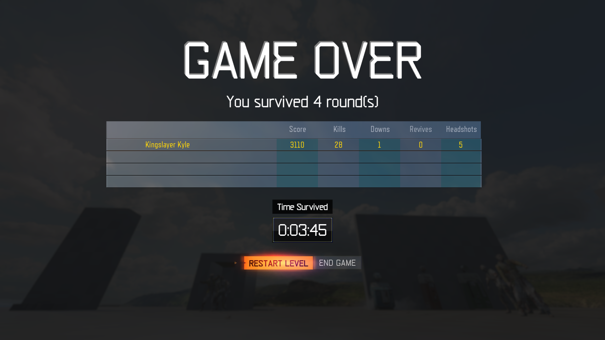

# End-game menu
- Allows you to add an end-game menu to your zombies map

## Screenshot


## Installation
1) Place the contents of `your_maps_folder` into your map's folder

2) Add the following to your maps zone file:
```
// End-game menu
scriptparsetree,scripts/zm/_zm_intermission_menu.gsc
scriptparsetree,scripts/zm/_zm_intermission_menu.csc
rawfile,ui/uieditor/menus/Intermission/Intermission_Main.lua
```

3) Add to your map's gsc & csc
```
#using scripts\zm\_zm_intermission_menu;
```

4) Link your map and run it :)

## Credits
Kingslayer Kyle\
Scobalula\
JariK