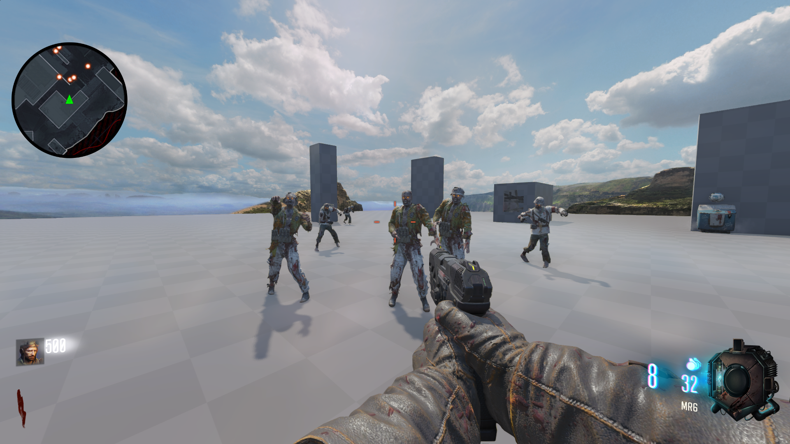

# Minimap widget
- Allows you to add a minimap to your zombies map

## Requirements
- [Waypoints widget](https://github.com/KingslayerKyle/T7LuaRepo/tree/main/Custom/Standalone/Waypoints) (This needs to be added to your map first)

## Screenshot


## UI
1) Drag & drop `ui` into your maps folder

2) Add the following to your maps zone file:

```
rawfile,ui/uieditor/widgets/HUD/KingslayerMinimapWidget/KingslayerMinimapContainer.lua
rawfile,ui/uieditor/widgets/HUD/KingslayerMinimapWidget/KingslayerMinimap.lua
```

3) Open your T7Hud_zm_factory.lua file. If you don't have this you can find it here:
- [T7Hud_zm_factory.lua](https://github.com/KingslayerKyle/T7LuaRepo/blob/main/Ship/ui/uieditor/menus/hud/T7Hud_zm_factory.lua)

4) Underneath your requires paste the following:

`require( "ui.uieditor.widgets.HUD.KingslayerMinimapWidget.KingslayerMinimapContainer" )`

5) After `self.anyChildUsesUpdateState = true` paste the following:

```
self.KingslayerMinimapContainer = CoD.KingslayerMinimapContainer.new( self, controller )
self.KingslayerMinimapContainer:setLeftRight( true, true, 0, 0 )
self.KingslayerMinimapContainer:setTopBottom( true, true, 0, 0 )
self:addElement( self.KingslayerMinimapContainer )
```

6) After `LUI.OverrideFunction_CallOriginalSecond( self, "close", function ( element )` paste the following:

`element.KingslayerMinimapContainer:close()`

## Scripts

1) Add to your zone
```
scriptparsetree,scripts/zm/_zm_minimap.gsc
objective,zm_enemy_waypoint
material,compass_map_mp_combine
image,minimap_circle_bg
image,minimap_circle_mask
```

2) Add to your gsc
```
#using scripts\zm\_zm_minimap;
```

## Radiant

1) Create a `script_origin` and give it the targetname KVP of `minimap_corner`

2) Duplicate the `script_origin` so that you have two of them

3) Place one in the top-right corner of the map and one in the bottom-left corner of the map

## Adjusting minimap zoom

1) Go in-game and open console command

2) Adjust the "compassmaxrange" dvar value until it looks correct and remember the value

3) Find and open `scripts/zm/_zm_minimap.gsc`

4) Change the value of `SetDvar( "compassmaxrange", "1000" );`

## Creating a custom image for your minimap

1) Check `docs_modtools/Mini_Map_Setup.pdf` for tips on how to create a custom image for your minimap

2) Replace `material,compass_map_mp_combine` in your zone with the custom minimap material you created

3) Find and open `scripts/zm/_zm_minimap.gsc`

4) Change `compass::setupMiniMap( "compass_map_mp_combine" );` to the custom minimap material you created

## Credits
Kingslayer Kyle\
Scobalula\
JariK