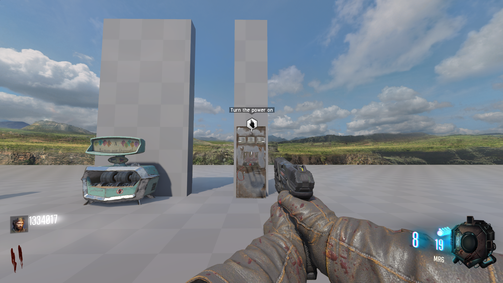
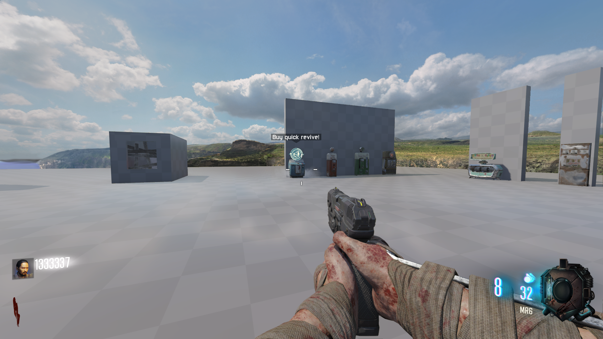
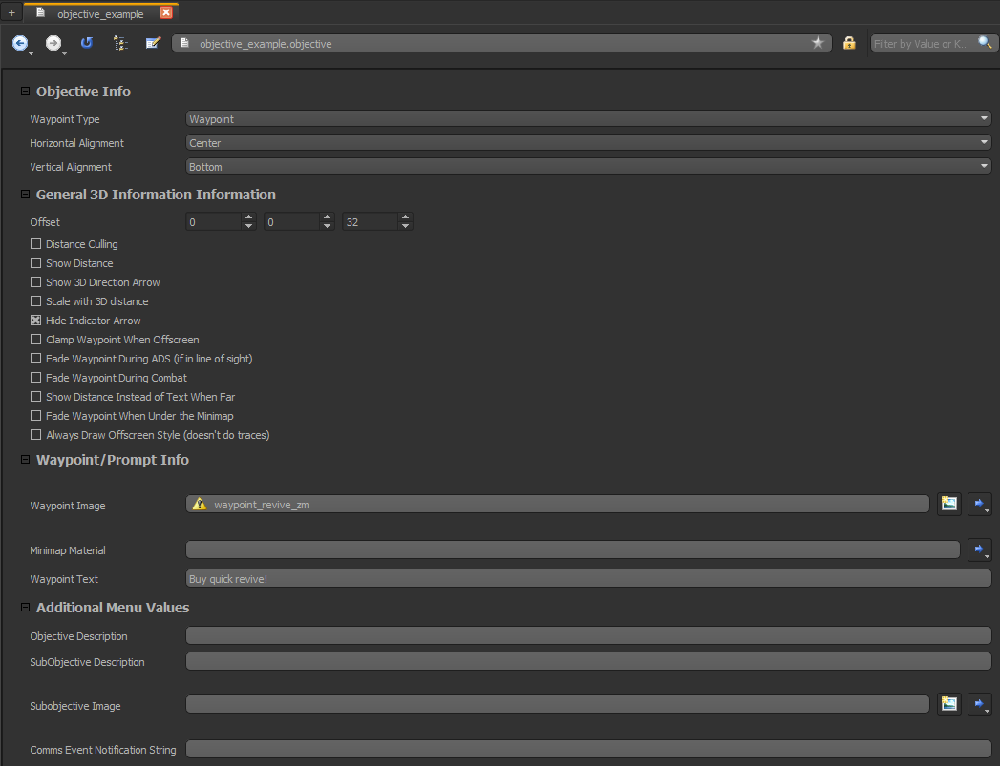

# Waypoints widget
- Allows you to add waypoints to your map
- Included gdt with example objective
- Objective image/text can be edited on the objective asset in ape

## Screenshot






## UI Installation
1) Drag & drop `ui` into your maps folder

2) Add the following to your maps zone file:

```
rawfile,ui/uieditor/widgets/HUD/KingslayerWaypointsWidget/KingslayerWaypointsContainer.lua
```

3) Open your T7Hud_zm_factory.lua file. If you don't have this you can find it here:
- [T7Hud_zm_factory.lua](https://github.com/KingslayerKyle/T7LuaRepo/blob/main/Ship/ui/uieditor/menus/hud/T7Hud_zm_factory.lua)

4) Underneath your requires paste the following:

`require( "ui.uieditor.widgets.HUD.KingslayerWaypointsWidget.KingslayerWaypointsContainer" )`

5) After `self.anyChildUsesUpdateState = true` paste the following:

```
self.KingslayerWaypointsContainer = CoD.KingslayerWaypointsContainer.new( self, controller )
self.KingslayerWaypointsContainer:setLeftRight( true, true, 0, 0 )
self.KingslayerWaypointsContainer:setTopBottom( true, true, 0, 0 )
self:addElement( self.KingslayerWaypointsContainer )
```

6) After `LUI.OverrideFunction_CallOriginalSecond( self, "close", function ( element )` paste the following:

`element.KingslayerWaypointsContainer:close()`

## Adding objectives

1) Zone
```
objective,objective_example
```

2) GSC
```
#using scripts\shared\gameobjects_shared;
#precache( "objective", "objective_example" );

// Add the objective
exampleObjId = gameobjects::get_next_obj_id();
objective_add( exampleObjId, "active", origin, istring( "objective_example" ) );

// Delete the objective
objective_delete( exampleObjId );
gameobjects::release_obj_id( exampleObjId );
```

## Credits
Kingslayer Kyle\
Scobalula\
JariK